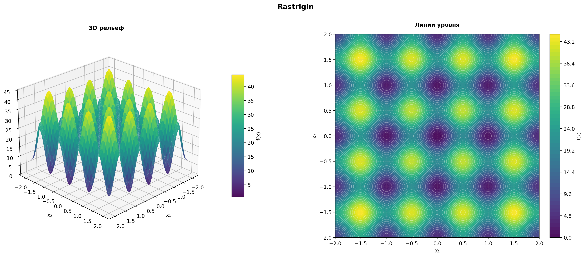

# Numerical Optimization Portfolio

Коллекция учебно-исследовательских ноутбуков по численным методам оптимизации: от градиентного спуска и методов второго порядка до оптимизаторов машинного обучения, роя частиц и имитации отжига.



## Что демонстрирует проект

- реализацию алгоритмов оптимизации с нуля;
- постановку и проведение вычислительных экспериментов;
- сравнение с библиотечными реализациями SciPy и PyTorch;
- анализ сходимости, устойчивости и влияния гиперпараметров;
- визуализацию траекторий и интерпретацию результатов;
- применение оптимизации к линейному SVM и задаче N ферзей.

## Состав репозитория

| Работа | Методы и задачи | Формат | Материалы |
| --- | --- | --- | --- |
| 1. Градиентный спуск | Экспоненциальный, обратный и адаптивный шаг; поиск Армихо; Ackley, Booth, Eggcrate, Plateau, Rastrigin, Weierstrass | Аналитический отчёт с 36 встроенными визуализациями | [Описание](docs/01-gradient-descent.md) · [Ноутбук](notebooks/01_gradient_descent.ipynb) |
| 2. Классические методы | Newton, BFGS, Nelder–Mead; влияние начальной точки и геометрии функции | Исполняемый ноутбук | [Описание](docs/02-classical-methods.md) · [Ноутбук](notebooks/02_newton_bfgs_nelder_mead.ipynb) |
| 3. Оптимизация в ML | SGD, Momentum, Nesterov, AdaGrad, RMSProp, Adam; batch size; регуляризация; линейный SVM | Исполняемый ноутбук | [Описание](docs/03-ml-optimizers.md) · [Ноутбук](notebooks/03_ml_optimizers_and_svm.ipynb) |
| 4. Стохастическая оптимизация | Simulated Annealing, Particle Swarm Optimization, подбор гиперпараметров, N ферзей | Исполняемый ноутбук | [Описание](docs/04-stochastic-methods.md) · [Ноутбук](notebooks/04_stochastic_optimization.ipynb) |

## Быстрый запуск

Рекомендуемая версия — Python 3.11. Команды для Windows Command Prompt:

```bat
py -3.11 -m venv .venv
.venv\Scripts\activate
python -m pip install --upgrade pip
pip install -r requirements.txt
jupyter lab
```

Для Linux или macOS:

```bash
python3.11 -m venv .venv
source .venv/bin/activate
python -m pip install --upgrade pip
pip install -r requirements.txt
jupyter lab
```

После запуска откройте нужный файл из каталога `notebooks/` и выберите **Kernel → Restart Kernel and Run All Cells**. Запускайте работы независимо друг от друга; общий порядок не требуется.

## Воспроизведение результатов

1. Создайте чистое виртуальное окружение и установите зависимости.
2. Запустите JupyterLab из корня репозитория — так создаваемые изображения попадут в каталог `results/`.
3. Перезапустите ядро выбранного ноутбука и выполните все ячейки сверху вниз.
4. Сравните итоговые таблицы, значения целевых функций и графики с выводами в соответствующем описании.
5. При необходимости повторите стохастические эксперименты с другим seed и оцените разброс результатов.

Первый ноутбук является сохранённым аналитическим отчётом: графики встроены в файл, однако вычислительный код в полученном исходнике отсутствовал. Остальные работы содержат самостоятельные блоки запуска.

## Проверка структуры

Быстрая проверка JSON-структуры, метаданных ядра и синтаксиса исполняемых ячеек:

```bash
python scripts/check_notebooks.py
```

Проверка не выполняет тяжёлые эксперименты и не требует установленных NumPy, SciPy или PyTorch.

## Структура проекта

```text
optimization-methods-portfolio/
├── .github/workflows/       # автоматическая структурная проверка
├── assets/                  # изображение для главной страницы
├── docs/                    # постановка, методы, результаты и запуск каждой работы
├── notebooks/               # четыре Jupyter Notebook
├── scripts/                 # локальная проверка ноутбуков
├── .gitignore
├── README.md
└── requirements.txt
```

## Технологии

Python, NumPy, SciPy, pandas, Matplotlib, PyTorch, JupyterLab.

